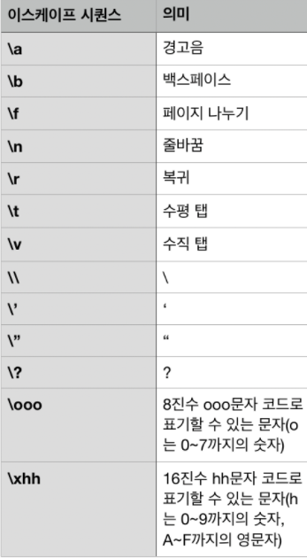
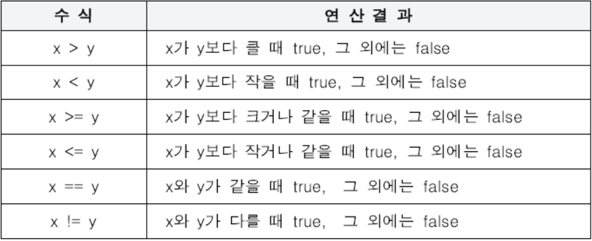
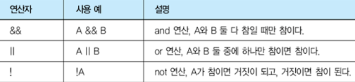
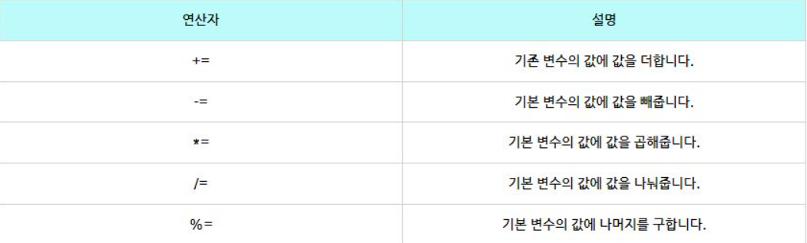
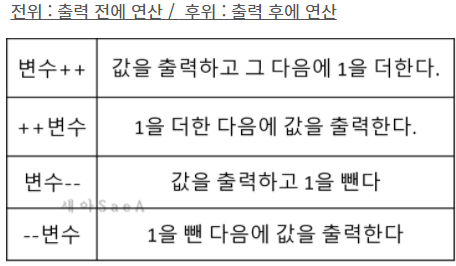
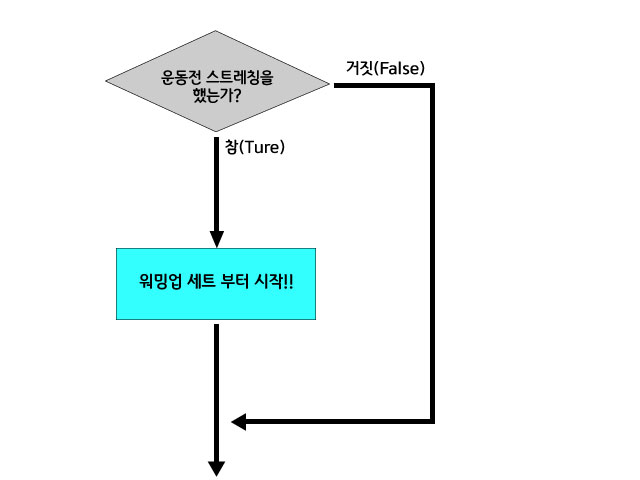
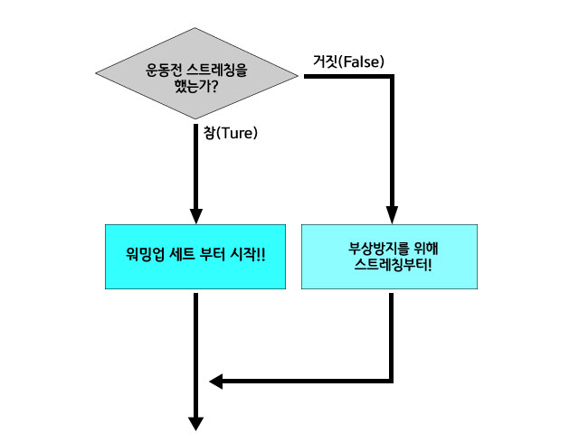
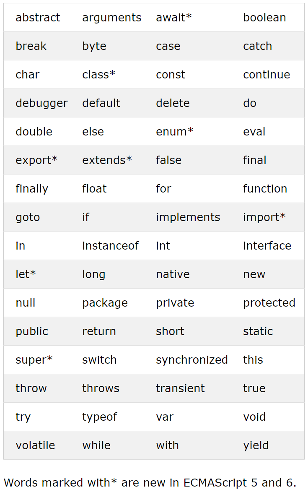

#   박민형   [201840212]

## ~~~~~ [ 03월 30일 ] ~~~~~

### 3. 중첩 조건문

> if 문 작성시에 중첩하여 작성하는것이 가능하지만 필요이상의 조건문이 과다하게 사용되었는지 주의가 필요합니다.

### 4. if else if 조건문

>중복되지않는 세 가지 이상의 조건울 구분할때 사용합니다

if(){

} else if (){

} else if () {

} else {

}

##### ★ 조건문에 조건식 작성시
> 수학에서 어떠한수 a에 대한 범위를 " 100 < a < 1000 " 라고 표현 하지만 프로그래밍 언어로 표현 할때에는
100 < a && a < 1000 이러한 식으로 논리연산자를 활용하여 표현하여야한다
### 5. switch 조건문
<pre>
<code>
switch (<비교할값>){
    case(결과값 1){
        <출력할내용>
        break;
    }
    case(결과값 2){
        <출력할내용>
        break;
    }
    case(결과값 3){
        <출력할내용>
        break;
    }
}
</code>
</pre>

<b>★★★ break; 를 작성하지않으면 해당 결과값 아래에 있는 모든 코드를 시행 하므로 주의가 필요하다.</b>

### 6. 삼항 연산자
> <불 표현식> ? <참> : <거짓>

<pre>
<code>
let number = 10;
console.log(number % 2 == 0? "짝수" : "홀수" ) 
</code>
</pre>

### 7. 짧은 초기화 조건문
> || 연산자를 불이 아닌 자료에 사용하는 경우
> * a||b 에서 a가 참인 경우 a로 대치
> * a||b 에서 a가 거짓이라면 b로 대치 

### 8. 조금더 나아가기
>웹 브라우저에서 작동하는 자바스크립트: prompt() 이름의 함수를 받음
>node.js에서 작동하는 자바스크립트: 단순한 코드로 입력을 받을 수 없음 p.105

##  4장  반복문
>배열 생성하고 사용하는 방법을 익힙니다.
>while / for 반복문을 이해합니다.
>for in / for of 반복문을 이해합니다.
>break / continue 키워드를 이해합니다.

### 0. 반복문
>코드를 복사하여 출력이 가능은 하지만 1000줄 2000줄도 그렇게하기에는 무리가있다
>그렇기에 반복문을 사용하는것이 바람직하다.

### 1. 배열
>* 여러 개의 자료를 한꺼번에 다룰수있는 자료형
>* 대괄호 내부의 각 자료는 쉼표로 구분
>* 배열에는 여러 자료형이 섞일수있음

요소: 배열안에 들어있는 각 자료

### 2. while 반복문
<pre>
<code>
    while( 조건식 ){
        //조건식이 참일때 시행할 내용
    }
</code>
</pre>
> 조건식에 true 값을 넣으면 무한반복문을 만들수도 있다.
while 문은 반복횟수가 불특정한 경우에 주로 사용한다.
후에 기술할 for 문은 주로 반복횟수가 비교적 정확한 경우에 사용한다.

### 3. for 반복문
>for 반복문의 각 단계
1.  초기식을 비교
2.  조건식을 비교
    조건이 false이라면 반복문 종료
3.  문장을 실행
4.  종결식을 실행
5.  2단계로 이동

### 4. 역 for 반복문
>보통 증감연산자를 ++를 사용하나 반대로 --를 사용하는 경우도 존재한다.

<code>
for (let i = 0;i >=0 ; i--){
}
</code>

### 5. for in / for of 반복문

<code>

let 배열 = [~~ 배열 내용 ~~]
for (let 인덱스 in 배열){
    index 값이 필요할때
}

for (let 요소 of 배열){
    단순하게 배열내부에 값들만 필요할때
}
</code>

## ~~~~~  [ 03월 23일 ]  ~~~~~

### 3.2 문자열
>문자의 집합을 의미하며 "hello world","안녕하세요"등의 형태를 문자열이라고 한다

##### 기본 문자열
>자바 스크립트에서는 기본적으로 큰 따옴표(""),작은 따옴표('') 안에 문자열을 생성한다
>ex) '안녕하세요' / "반갑습니다"
>방법은 자유이지만 될수있다면 <u>한가지로 통일하는것을 권장한다</u>단, 문자열 내부에 따옴표를 사용해야되는 경우에는 동시에 사용하기도한다
>'친구가 멀리 걸어오는 선생님에게 허리를 숙이며 "안녕하세요 선생님" 이라고 했다'

##### 이스케이프 문자
>이스케이프 문자는 특수기능을 수행하는 문자입니다

| 이스케이프 시퀀스 | 의미 |
|:--|--|
|\a|경고음|
|\b|백스페이스|
|\f|페이지 나누기|
|\n|줄바꿈|
|\r|복귀|
|\t|수평 탭|
|\v|수직 탭|
|\\|\|
|\'|'|
|\"|"|
|\?|?|
|\ooo|8진수 ooo문자 코드로표기할수있는문자(o은 0~7까지의 숫자)|
|\xhh|16진수 hh문자코드로 표기하는문자(h는 0~9까지의 숫자)|

<!--  -->

#### 문자열 연결 연산자
>문자열 연결 연산자(+)로 문자열을 연결할수있습니다.

console.log("안녕"+"하세요");
->안녕하세요

#### 문자 선택 연산자
>문자 선택 연산자는 특정한 문자 선택이 가능합니다

console.log("안녕하세요"[0]);
console.log("안녕하세요"[1]);
console.log("안녕하세요"[4]);

안
녕
요

#### 템플릿 문자열 (ECMAScript6)
>`기호로 생성이 가능합니다 생성된 문자는 작은 따옴표로 만든 문자열이 생성된다 추가로 내부에 ${표현식}을 넣어서 계산된 값이 출력되도록 할수있습니다.단,미 지원 브라우저가 존재할수있으므로 사용에 주의가 필요합니다.

`52 + 723 = ${52+ 723}`
->52 + 723 = 325

### 3.3 불
>참/거짓을 판별 하여 표현하여야될때 사용합니다 주로 비교연산자를 활용하여 두개 혹은 그이상의 값을 확인하여 참과 거짓의 값을 받아오게됩니다

#### 비교 연산자

<!--  -->

| 수 식 | 연 산 결 과 |
|:--|--|
| x > y |x가 y보다 클때 ture 나머지 false|
| x < y |x가 y보다 작을때 ture 나머지 false|
| x >= y|x가 y보다 크거나 같을때 ture 나머지 false|
| x <= y|x가 y보다 작거나 같을때 ture 나머지 false|
| x == y|x와 y가 같을때 ture 나머지 false|
| x != y|x와 y가 같지않을때 ture 나머지 false|

>예시 console.log(50 > 300); -> false

#### 논리 연산자

<!--  -->

|연산자|사용 예|설명|
|:--|--|--|
| &&    | A && B    | and연산, A와B 모두 참일때만 참이다.   |
| \|\|  | A \|\| B  | OR연산, A 혹은 B 둘중 하나만 참이어도 참이다.  |
| !     | !A        | NOR연산, A가 참이면 거짓 , 거짓이면 참이된다.  |

>예시 console.log(!true); -> false
>논리 합연산자(||) 혹은 논리 곱 연산자(&&)를 사용하는 경우가 꽤 많은 편인데 주의할점으로는 범위에 대한 판단인데 예를 들어 [ 30 > 20 > 10 ] 이런 식으로 만든다면 false라고 반환이 된다 이유는 컴퓨터는 왼쪽부터 우선순위를 두어 30 > 20 을 true값으로 변환 하고 true는 1로 변환 1>10은 false이기에 정답은 false를 내어주게 됩니다

>3< 현재시간 <8 라는 범위를 만든다 가정하면
> 현재시간 < 3 || 현재시간 < 8 이런식으로 만들어야된다

### 4 변수
>변수는 값을 저장하여 사용할때 사용합니다
>숫자및 모든 자료형을 담을수있습니다.

>변수를 선언 하고 값을 할당하여 사용할수있게됩니다.

let 변수이름 (변수 를 선언합니다)

변수이름 = 변수에 저장할 값 (변수에 값을 할당)

### 5. 복합 대입 연산자
> ( = ) 대입 연산자를 활용해서 사용이가능한 특수한 연산자가 존재합니다, += 연산자는 문자열을 더해줄때에도 사용이 가능합니다.

<!--  -->

|연산자|설명|
|--|--|
|+=|기존 변수의 값에 값을 더합니다.|
|-=|기존 변수의 값에 값을 빼줍니다.|
|*=|기존 변수의 값에 값을 곱해줍니다.|
|/=|기존 변수의 값에 값을 나눠줍니다.|
|%=|기존 변수의 값에 나머지를 구해줍니다.|

### 6. 증감 연산자
>변수에 적용이 가능한 연산자로 전위 혹은 후위에 붙여서 가능하며 전위와 후위에 차이에 주의를 하며 사용하여야됩니다.

<!--  -->
|증감 연산자|설명|
|--|--|
|++X|먼저 피연산자의 값을 1 감소 후에 연산진행|
|X++|먼저 해당연산 진행후 피 연산자의 값을 1 감소|
|--X|먼저 피연산자의 값을 1 감소 후에 연산진행|
|X--|먼저 해당연산 진행후 피 연산자의 값을 1 감소|

### 7. 자료형 검사
>변수에 원하는 형태의 자료형이 존재하는지 알아보가 위해 사용이 가능한 방법이 존재합니다

typeof - 해당 변수의 자료형을 추출합니다.

ex) typeof 10 > 'number'  /  typeof "문자열" > 'string'

### 8. undefined 자료형
>undefined 자료형은 변수는 선언하였으나 초기화를 진행하지않은 상황 일때 나타납니다

ex)  let a (변수선언 초기화x) > undefined

### 9. 강제 자료형 변환
>자료형의 형태를 강제로 바꾸고 싶으면 해당 변수를 활용할수 있습니다

Number()    >   숫자로 변환합니다
String()    >   문자열로 변환합니다
Boolean()   >   불로 변환합니다

>String() 함수는 매개변수로 숫자를 넣으면 문자열로 변환해주며 매우 간단합니다 true,false등 불값도 가능합니다
단 number,boolean은 결과값과 true,false 로 변환되는 방법에 주의점이 생기므로 사용에 주의가 필요

#### 9-1 Number() 함수와 NaN

>Number()에 숫자로 구성된 문자를 삽입시 숫자로 변환이 가능하며 불값인 true,false는 각각 1,0으로 변환이 됩니다 추가로 숫자가 아닌 문자열은 NaN( Not a Number ) 로 출력합니다

NaN ( Not a Number )의 특징
NaN 은 무조건 다릅니다
NaN 은 숫자 자료형은 맞지만 숫자가 아닙니다
NaN 을 확인할때에는 isNaN() 을 사용합니다

#### 9-2 Boolean()
>다음 5개의 요소를 true 로 반환 그 이외의 요소는 false로 반환합니다.

0   /   NaN   /   ""[빈 문자열]  /  null   /   undefined

### 10 자동 자료형 변환

>숫자와 문자열에 + 를 사용하면 자동으로 숫자가 문자열로 변환됩니다.

1. 10 + 20      >   30  
2. "10" + 20    >   1020
3. 10 + "20"    >   1020
4. "10" + "20"  >   1020

### 11 일치 연산자

>일치 연산자는 기존에 비교 연산자와는 달리 <u> 자료형도 일치하는지 확인하는 </u> 연산자 입니다

=== > 자료형과 값이 동일한지 확인합니다
!== > 자료형과 값이 다른지 확인합니다

### 12. 상수

>ECMA Script6 부터 생긴 것으로 상수를 만들수있습니다 상수는 <u> '항상 같은수'라는 의미로 변수와 반대되는 개념 </u> 입니다. 상수는 선언후 초기화된 값에서 변경이 불가능 합니다.

## 3장 조건문

### 1. if 조건문
>조건문 중에서 가장 간단한 형태의 조건문 입니다

if ( 조건식 ) { 조건에 해당할때 시행되는 코드 }

### 2. if-else 조건문
>2가지로 분명하게 나뉘는 상황에서 사용이 가능한 조건문입니다.

if ( 조건식 ) {
    조건식이 참 일때 시행되는 코드
} else {
    조건식이 거짓일때 시행되는 코드
}

## ~~~~~  [ 03월 16일 ]  ~~~~~
### 2 자바 스크립트로 할 수 있는 일
>자바 스크립트 초기에는 웹 클라이언트 개발에만 이용이 가능하였음  
>2010년 이후 서버,게임,스마트폰 어플리케이션,데스크톱 에플리케이션 개발등... 
>다양한 분야에도 사용이 가능한 언어로 발전되었습니다

#### 2.1 웹 클라이언트 애플리케이션 개발
> 자바스크립트는 웹 브라우저에서 실행되는 <u>웹 클라이언트 애플리케이션 개발을 목적</u>으로 만들어졌습니다.
> 자바 스크립트는 <u>모든 웹 브라우저에서 작동이 가능</u>한 유일한 프로그래밍 언어 입니다

#### 2.2 웹서버 개발
> 기존의 웹 클라이언트는 개발은 자바스크립트 웹 서버는 c#,자바,루비,파이썬 등의 언어로 개발 되었습니다. 그래서 웹 개발을 시도하려면 2가지의 언어를 사용해야되었습니다.
> node.js의 등장으로 자바스크립트 만 사용하여 클라이언트와 서버를 하나의 언어로 개발하는것이 가능해졌습니다.

@웹 페이지를 직접적으로 출력 하지 않아도 웹 프로토콜 (http / https) 을 활용하면 웹 서버로 칭합니다

>node.js 의 단점으로는 웹 서버 개발시에 간단한 모듈을 제공하고 있기때문에 다른 스크립트 언어에 비하여 데이터 처리및 예외 처리등이 다소 복잡할수 있습니다.
>장점으로는 서버 유지비가 평균적으로 1/10정도 로 줄어들지만 20배 이상 빠른 처리 속도를 보여 주기에 큰 메리트가 존재합니다.

#### 2.3 모바일 애플리케이션 개발
>스마트폰에 사용되는 언어는 pc에 비해 제한적입니다.
>자바 혹은 스위프트 로 개발되어 기본적으로 인식이 가능한 언어로 만들어진 애플리케이션을 '네이티브 애플리케이션' 이라고 합니다.

>기업에서 애플리케이션을 개발을 할때에는 자바와 스위프트를 모두 사용해서 만들어야되는데 시간,인력등 비용이 2배가 들어가게됩니다.

>하지만 자바 스크립트를 사용한다면 모든 스마트폰에서 인식이 가능하도록 개발이 가능합니다.

*react native: 자바스크립트로 네이티브 애플리케이션을 개발이 가능하도록 해줌 페이스북,사운드 클라우드 등 자바스크립트로 제작됨

#### 2.4 데스크톱 애플리케이션 개발

>자바스크립트로 모바일 애플리케이션 개발이 증가하자 데스크톱 애플리케이션 도 자바스크립트로 만들자는 의견이 발생

>자바스크립트로 개발 전용 텍스트 에디터를 제작및 배포

#### 2.5 게임 개발

>기존의 게임은 서버와 클라이언트 모두 c++로 제작 되어왔습니다,개발의 난이도는 높으편 이지만 c++가 동작하는 속도가 빠르기때문

>스마트폰이 활성화가 되어가면서 여러가지 운영체제에 맞는 앱을 개발하지말고 한번에 모든 운영체제에서 구동이 가능한 애플리케이션을 개발하는것이 경제적으로 이득이기 때문이며 특히 게임은 다른 분야보다 복잡하고 비용이 많이들어가기 때문입니다

>초기에는 플래시와 같은 모든 운영체제에서 구동이 가능한 플렛폼을 활용했습니다 애니팡도 플래시로 만들어졌습니다

>고가의 게임 엔진이 저렴하게 배포되기 시작했는데 그것이 바로 '유니티'입니다

>유니티는 모노 프로그램을 기반으로 유니티 스크립트,마이크로소프트에서 만든 c#을 이용해서 다양한 플래폼(윈도우,맥,리눅스...)등에서 동작이 가능합니다 한마디로 자바스크립트를 통하여 모든 운영체제를 호환하는 게임을 개발할수 있다는것입니다

#### 2.6 데이터베이스 관리

>데이터베이스 는 보통 SQL프로그래밍 언어를 이용해서 관리합니다.

>Oracle,MySQL,Microsoft SQL Server,MongoDB, PostgreSQL등 을 사용합니다 그중 MongoDB 는 자바스크립트를 사용하는 NoSQL입니다

## 2장~~~~~~~~~~~~~~~~~~~~~~~~~

### 1 기본 용어
> 자바 스크립트에서 자주 사용되는 기본 용어 입니다.

#### 1.1 표현식과 문장
>273
>10 + 20 + 30 * 2
>"JavaScript Programming"
표현식이 모여서 문장이되고 그 문장이 마칠때마다 세미콜론 < ; > 을 반드시 찍어주어야됩니다. 그러면 그 문장들이 모여서 하나의 프로그램이 될것입니다.

console.log("hello world...!"); <- ; 반드시

#### 1.2 키워드 
키워드는 특별한 의미가 부여된 단어로 자바스크립트를 처음 개발하던때에 정한 단어 입니다 해당 단어로 식별자를 만드는 것은 불가능합니다.
<!--  -->
||||||
|--|--|--|--|--|--|
|abstract|arguments|await*|boolean|break|byte|
|case|catch|char|class*|const|continue|
|debugger|default|delete|do|double|else|
|enum*|eval|export*|extends*|false|final|
|finally|float|for|function|goto|if|
|implements|import*|in|instanceof|int|interface|
|let*|long|native|new|null|package|
|private|protected|public|return|short|static|
|super*|switch|synchronized|this|throw|throws|
|transient|ture|try|typeof|var|void|
|volatile|while|with|yield||
*표시가된 단어는 ECMAScript 5,6 에서 추가된 단어입니다.

#### 1.3 식별자
>변수,함수등에 임의로 붙이는 이름입니다,단 다음과 같은 규칙에 따릅니다

>1. 키워드를 사용할수 없습니다.
>2. 특수문자는 _ 와 $ 만 가능합니다.
>3. 숫자로 시작할수 없습니다.
>4. 공백은 입력할수 없습니다.

>예시
>가능: alpha / alpha10 / _alpha 
>불가능 : break(키워드 x) / 273alpha (숫자로 시작x) / has space (공백x)

>자바스크립트에서 식별자를 만드는 관례
>1. 생성자 함수의 이름은 대문자로 시작한다
>2. 변수,함수,속성,메소드의 이름은 소문자로 시작한다
>3. 여러 단어로 된 식별자는 각단어의 시작을 대문자로 한다

#### 1.4 주석

>프로그램 진행에 전혀 영향을 주지않는 코드로 프로그램을 설명할때 주로 사용됩니다

>주석처리방법
<pre>
    <code>
        // single line comment (한줄 주석을 필요러 할때 //을 사용)

        /*
            comment 1   (두줄 이상의 주석을 필요로 할때)
            comment 2   (/**/안에 내용을 넣어서 사용)
        */
    </code>
</pre>

#### 2 출력

> 메세지를 출력하는 기본적인 방법

#### 2.1 출력 메소드

>console.log(" 내용 !!")
>     > 내용 !!
이렇게 출력이 됩니다

#### 2.2 REPL 을 사용한 출력

> 터미널에 NODE를 입력하고 바로 입력하면 바로 출력이됩니다

### 3 기본 자료형

#### 3.1 숫자

>숫자는 이름 그대로 23,567,0,10,12 와같은 것을 의미합니다 출력에서 본 CONSOLE.LOG()를 통하여 생성이 가능합니다

>+,-*,/ 등을 이용해서 사칙연산도 가능하며, %로 몫을 구할수있고 ()우선순위 도 가능합니다
#### 최근내용이 상단에 표시될수있도록 정렬할것
