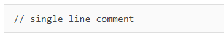
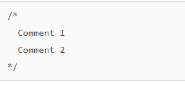

#   박민형   [201840212]
## [ 03월 16일 ]
### 2 자바 스크립트로 할 수 있는 일
>자바 스크립트 초기에는 웹 클라이언트 개발에만 이용이 가능하였음  
>2010년 이후 서버,게임,스마트폰 어플리케이션,데스크톱 에플리케이션 개발등... 
>다양한 분야에도 사용이 가능한 언어로 발전되었습니다

#### 2.1 웹 클라이언트 애플리케이션 개발
> 자바스크립트는 웹 브라우저에서 실행되는 <u>웹 클라이언트 애플리케이션 개발을 목적</u>으로 만들어졌습니다.
> 자바 스크립트는 <u>모든 웹 브라우저에서 작동이 가능</u>한 유일한 프로그래밍 언어 입니다

#### 2.2 웹서버 개발
> 기존의 웹 클라이언트는 개발은 자바스크립트 웹 서버는 c#,자바,루비,파이썬 등의 언어로 개발 되었습니다. 그래서 웹 개발을 시도하려면 2가지의 언어를 사용해야되었습니다.
> node.js의 등장으로 자바스크립트 만 사용하여 클라이언트와 서버를 하나의 언어로 개발하는것이 가능해졌습니다.

@웹 페이지를 직접적으로 출력 하지 않아도 웹 프로토콜 (http / https) 을 활용하면 웹 서버로 칭합니다

>node.js 의 단점으로는 웹 서버 개발시에 간단한 모듈을 제공하고 있기때문에 다른 스크립트 언어에 비하여 데이터 처리및 예외 처리등이 다소 복잡할수 있습니다.
>장점으로는 서버 유지비가 평균적으로 1/10정도 로 줄어들지만 20배 이상 빠른 처리 속도를 보여 주기에 큰 메리트가 존재합니다.

#### 2.3 모바일 애플리케이션 개발
>스마트폰에 사용되는 언어는 pc에 비해 제한적입니다.
>자바 혹은 스위프트 로 개발되어 기본적으로 인식이 가능한 언어로 만들어진 애플리케이션을 '네이티브 애플리케이션' 이라고 합니다.

>기업에서 애플리케이션을 개발을 할때에는 자바와 스위프트를 모두 사용해서 만들어야되는데 시간,인력등 비용이 2배가 들어가게됩니다.

>하지만 자바 스크립트를 사용한다면 모든 스마트폰에서 인식이 가능하도록 개발이 가능합니다.

*react native: 자바스크립트로 네이티브 애플리케이션을 개발이 가능하도록 해줌 페이스북,사운드 클라우드 등 자바스크립트로 제작됨

#### 2.4 데스크톱 애플리케이션 개발

>자바스크립트로 모바일 애플리케이션 개발이 증가하자 데스크톱 애플리케이션 도 자바스크립트로 만들자는 의견이 발생

>자바스크립트로 개발 전용 텍스트 에디터를 제작및 배포

#### 2.5 게임 개발

>기존의 게임은 서버와 클라이언트 모두 c++로 제작 되어왔습니다,개발의 난이도는 높으편 이지만 c++가 동작하는 속도가 빠르기때문

>스마트폰이 활성화가 되어가면서 여러가지 운영체제에 맞는 앱을 개발하지말고 한번에 모든 운영체제에서 구동이 가능한 애플리케이션을 개발하는것이 경제적으로 이득이기 때문이며 특히 게임은 다른 분야보다 복잡하고 비용이 많이들어가기 때문입니다

>초기에는 플래시와 같은 모든 운영체제에서 구동이 가능한 플렛폼을 활용했습니다 애니팡도 플래시로 만들어졌습니다

>고가의 게임 엔진이 저렴하게 배포되기 시작했는데 그것이 바로 '유니티'입니다

>유니티는 모노 프로그램을 기반으로 유니티 스크립트,마이크로소프트에서 만든 c#을 이용해서 다양한 플래폼(윈도우,맥,리눅스...)등에서 동작이 가능합니다 한마디로 자바스크립트를 통하여 모든 운영체제를 호환하는 게임을 개발할수 있다는것입니다

#### 2.6 데이터베이스 관리

>데이터베이스 는 보통 SQL프로그래밍 언어를 이용해서 관리합니다.

>Oracle,MySQL,Microsoft SQL Server,MongoDB, PostgreSQL등 을 사용합니다 그중 MongoDB 는 자바스크립트를 사용하는 NoSQL입니다

## 2장~~~~~~~~~~~~~~~~~~~~~~~~~

### 1 기본 용어
> 자바 스크립트에서 자주 사용되는 기본 용어 입니다.

#### 1.1 표현식과 문장
>273
>10 + 20 + 30 * 2
>"JavaScript Programming"
표현식이 모여서 문장이되고 그 문장이 마칠때마다 세미콜론 < ; > 을 반드시 찍어주어야됩니다. 그러면 그 문장들이 모여서 하나의 프로그램이 될것입니다.

console.log("hello world...!"); <- ; 반드시

#### 1.2 키워드 
키워드는 특별한 의미가 부여된 단어로 자바스크립트를 처음 개발하던때에 정한 단어 입니다 해당 단어로 식별자를 만드는 것은 불가능합니다.

#### 1.3 식별자
>변수,함수등에 임의로 붙이는 이름입니다,단 다음과 같은 규칙에 따릅니다

>1. 키워드를 사용할수 없습니다.
>2. 특수문자는 _ 와 $ 만 가능합니다.
>3. 숫자로 시작할수 없습니다.
>4. 공백은 입력할수 없습니다.

>예시
>가능: alpha / alpha10 / _alpha 
>불가능 : break(키워드 x) / 273alpha (숫자로 시작x) / has space (공백x)

>자바스크립트에서 식별자를 만드는 관례
>1. 생성자 함수의 이름은 대문자로 시작한다
>2. 변수,함수,속성,메소드의 이름은 소문자로 시작한다
>3. 여러 단어로 된 식별자는 각단어의 시작을 대문자로 한다

#### 1.4 주석

>프로그램 진행에 전혀 영향을 주지않는 코드로 프로그램을 설명할때 주로 사용됩니다

>주석처리방법
한줄 주석

두줄이상 주석

#### 2 출력

> 메세지를 출력하는 기본적인 방법

#### 2.1 출력 메소드

>console.log(" 내용 !!")
>     > 내용 !!
이렇게 출력이 됩니다

#### 2.2 REPL 을 사용한 출력

> 터미널에 NODE를 입력하고 바로 입력하면 바로 출력이됩니다

### 3 기본 자료형

#### 3.1 숫자

>숫자는 이름 그대로 23,567,0,10,12 와같은 것을 의미합니다 출력에서 본 CONSOLE.LOG()를 통하여 생성이 가능합니다

>+,-*,/ 등을 이용해서 사칙연산도 가능하며, %로 몫을 구할수있고 ()우선순위 도 가능합니다
#### 최근내용이 상단에 표시될수있도록 정렬할것
